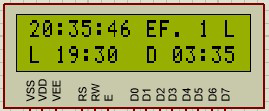
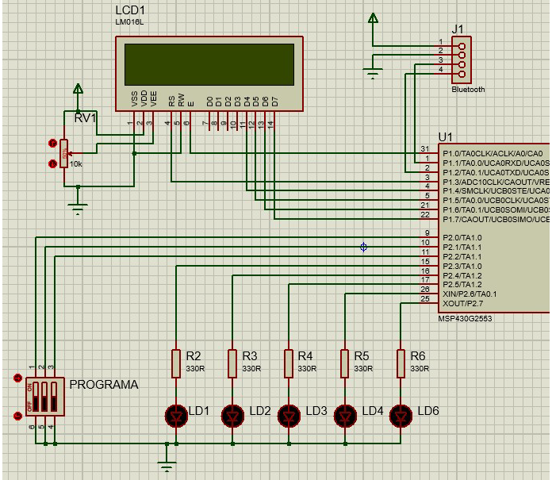

# MSP430 Yuletide Lights Controller

Firmware in C for the MSP430G2553 microcontroller implementing a timed LED effects controller with Bluetooth remote programming and LCD display.

Developed as a final project for the Microcontroller Systems course (EL83E) at the Federal University of Technology - Paraná (UTFPR), Curitiba, Brazil, 2019.

---

## Features

- 5 programmable LED lighting effects controlled via 3-bit DIP switch
- Real-time clock displayed on 16x2 LCD (HH:MM:SS)
- Scheduled on/off times programmable via Bluetooth
- Remote on/off toggle independent of scheduled times
- Bluetooth communication via UART (9600 bps, 8N1, RFCOMM)
- Android app integration (SimpleBluetoothTerminal)

---

## Hardware

| Component | Description |
|---|---|
| MCU | Texas Instruments MSP430G2553 |
| Display | LCD 16x2 (LM016L) |
| Bluetooth | HC-06 module |
| Inputs | 3-bit DIP switch |
| Outputs | 5 LEDs with 330Ω resistors |
| Other | 10K potentiometer (LCD contrast) |

**Toolchain:** IAR Embedded Workbench for MSP430

---

## LED Effects

| DIP Switch | Effect |
|---|---|
| 111 | Set current time |
| 110 | Set turn-on time |
| 101 | Set turn-off time |
| 100 | Effect 1 - sequential (one direction) |
| 011 | Effect 2 - sequential (both directions) |
| 010 | Effect 3 - center to edges |
| 001 | Effect 4 - edges to center |
| 000 | Effect 5 - all effects in sequence |

---

## Bluetooth Configuration

This project uses [SimpleBluetoothTerminal](https://github.com/kai-morich/SimpleBluetoothTerminal) for Android.

### Connection

1. Pair the HC-06 module with your Android device via Bluetooth settings
2. Open SimpleBluetoothTerminal
3. Tap the connection icon and select the HC-06 device
4. Set line ending to **LF** in the app settings

### Protocol

The firmware communicates via UART at 9600 bps, 8N1.

**Commands sent to the firmware:**

| Command | Description |
|---|---|
| `B\n` | Toggle effect on/off |
| `H XX\n` | Set hour (e.g. `H 09\n`) |
| `M XX\n` | Set minute (e.g. `M 30\n`) |

**Messages received from the firmware:**

| Message | Description |
|---|---|
| `S EFFECT: n\n` | Active effect number (1–5) |
| `S SET CURRENT TIME\n` | Firmware entered set current time mode |
| `S SET TURN-ON TIME\n` | Firmware entered set turn-on time mode |
| `S SET TURN-OFF TIME\n` | Firmware entered set turn-off time mode |
| `N 0\n` | Effect toggled off |
| `N 1\n` | Effect toggled on |
| `A 0\n` | Effect activation state off |
| `A 1\n` | Effect activation state on |

---

## LCD Display Layout

Reference layout provided in the course specification.

---

## Circuit Schematic

Reference circuit schematic provided in the course specification.

---

## Hardware Assembly

---

## Academic Origin

**University:** Federal University of Technology - Paraná (UTFPR)  
**Course:** Microcontroller Systems (EL83E)  
**Program:** Technology in Telecommunication Systems  
**Year:** 2019  
**Circuit Schematic & LCD Layout:** Prof. Sergio Moribe (UTFPR)  
**LCD Driver:** lcd_Port1.c by Prof. Sergio Moribe (UTFPR)